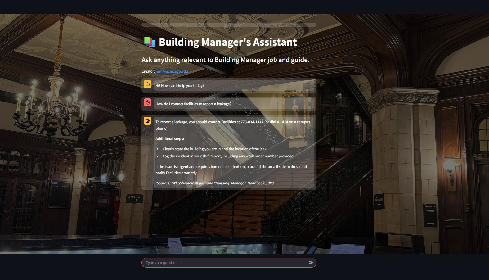
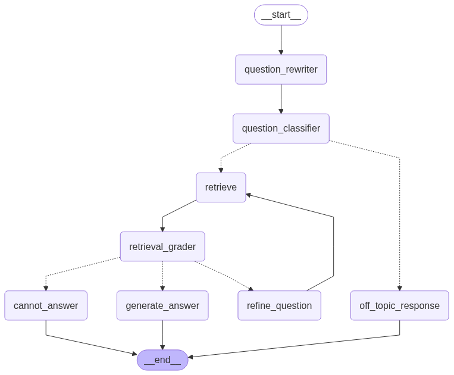

# 🏢 Building Manager's Multi-Agent RAG Assistant  

  

**A smart, document-aware chatbot** that helps building managers quickly find answers about facilities, events, emergencies, and more—powered by multi-agent workflows and Retrieval-Augmented Generation (RAG).  

👉 **Live Demo**: Request me at jazilkaleem@gmail.com

---

## 🔍 Features  
- **Multi-Agent Orchestration**: LangGraph-managed agents handle question rephrasing, retrieval grading, and answer generation.  
- **Comprehensive Knowledge Base**: Answers questions about:  
  - 📞 **Contacts**: Who to call for facilities, emergencies, etc.  
  - 🗝️ **Access**: Key/door mappings, building hours.  
  - 🍽️ **Amenities**: Menus, timings for coffee shops/pubs.  
  - 📅 **Events**: Schedules, setup requirements, AV needs.  
  - 👔 **Policies**: Dress code, shift protocols, radio etiquette.  
- **Self-Improving Workflow**: Auto-refines questions and filters irrelevant documents.  
- **Streamlit UI**: Clean, interactive chat interface with background customization.  

  

---

## 🛠️ Tech Stack  
| Component               | Technology Used                          |
|-------------------------|------------------------------------------|
| LLM                     | DeepSeek API (default) / Google Gemini   |
| Vector DB               | Chroma                                   |
| Embeddings              | HuggingFace `BAAI/bge-base-en-v1.5`     |
| Orchestration           | LangGraph                                |
| UI Framework            | Streamlit                                |
| Data Sources            | Web scraped data, PDFs, Excel files      |

---

